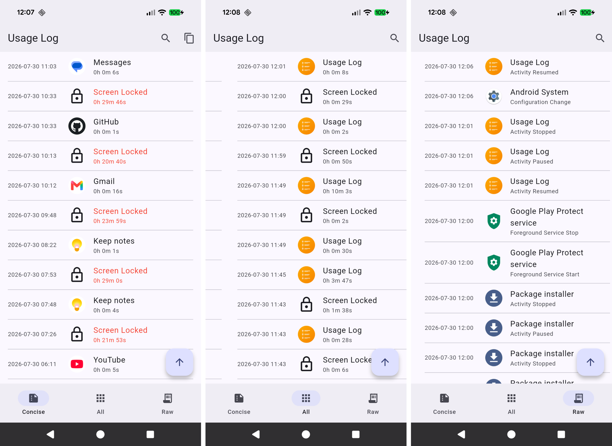

# Usage Log
Usage Log provides an easy way to check app usage on an Android phone. The app is built using **Flutter**, ported from its Android Native counterpart.

## Description
Usage Log converts `UsageStatsManager` event data and calculates how long each app has been used. The results are shown in three human-readable formats:
- **Concise** — shows only long "Screen Locked" gaps and the activity after each.
- **All** — shows every app's usage duration (excluding system apps).
- **Raw** — shows all raw events with their associated package names.

Switch between formats with the **bottom navigation bar**, or **swipe left and right**. In the Concise and All formats, activities lasting **longer than 20 minutes** are highlighted in red.

Tap the **search icon** in the app bar to filter the current list by app name.

**Pull down** to refresh the list with new entries.

**Long-press** an activity to copy its start and end time to the clipboard in `hhmmhhmm` format. For example, an activity from 11:00 to 14:00 copies as `11001400`.

Tap the **floating button** at the bottom right to scroll back to the top.

The interface uses **Material 3** and follows the **system light or dark theme**.

---
## Getting Started
Build the app and install `build/app/outputs/flutter-apk/app-release.apk`. Grant the permissions below, then refresh the screen by pulling down.

### Permissions
- `PACKAGE_USAGE_STATS` — required for the `UsageStatsManager` API.
- `QUERY_ALL_PACKAGES` — required to read app names and icons for all installed apps.

Grant these on the phone under Settings > Special app access > Usage Access: find the app and toggle it on.
