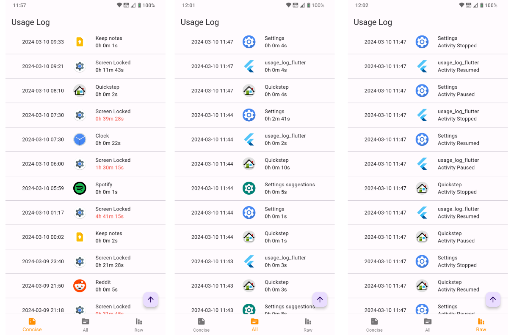

# Usage Log

Usage Log provides an easy way to check app usage on an Android phone.
The app is built using Flutter, which is a port from its Android Native
counterpart.

## Description

Usage Log converts UsageStatsManager event data and calculates how long
an app has been used. The results are displayed in human-readable
formats, as follows:

| **Format** | **Descriptions**                                           |
|------------|------------------------------------------------------------|
| All        | shows all Apps' usage duration (excluding system apps).    |
| Concise    | shows only “Screen Locked” activities and their durations. |
| Raw        | shows all raw events with their associated package names.  |

Users can switch between these formats easily with top navigation
buttons. In both “Concise” and “All” formats, activities with durations
exceeding 20 minutes are highlighted in red.

Swiping down will update the content with new entries.

Long pressing on an activity will copy the start time and end time of
the activity to clipboard in the format of “hhmmhhmm”. For example for
an activity starting from 11:00 to 14:00, the copied text is "06000830”.

Pressing on the bottom right floating button will scroll to the top of
the list.

## Getting Started

Find build\app\outputs\flutter-apk\app-release.apk and install it. Grant
permissions as described below and refresh the screen by swiping down.

### Permissions

PACKAGE_USAGE_STATS is required for using UsageStatsManager API and
QUERY_ALL_PACKAGES is required for getting App icons for all installed
apps.

Users need to grant these two permissions on their phones by navigating
to Settings \> Special app access \> Usage Access, find the app name and
toggle it on.
